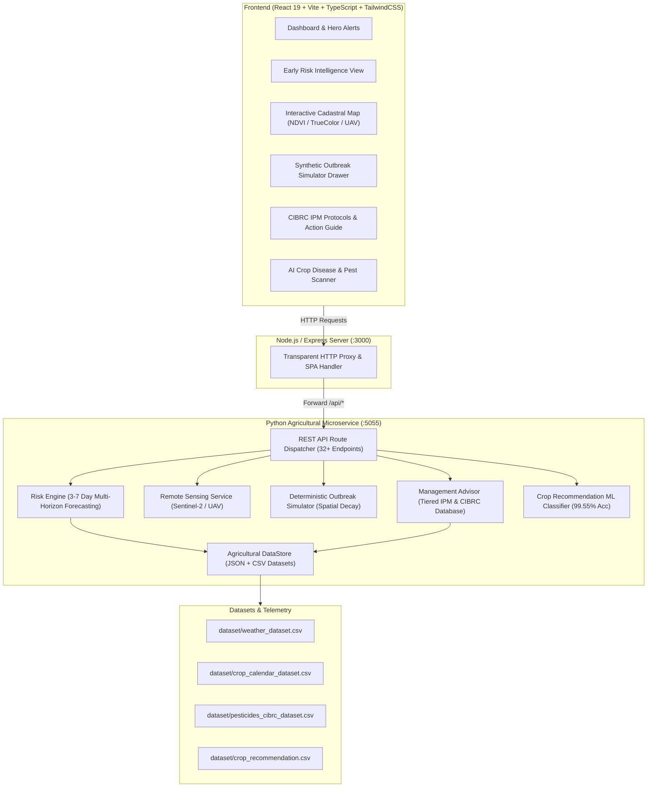

# AgriSense: Field-Level Early Warning & Crop Intelligence Platform

[](https://www.typescriptlang.org/)
[](https://react.dev/)
[](https://www.python.org/)
[](http://ppqs.gov.in/)
[](LICENSE)

> **Core Philosophy:** *"The farmer should NOT have to photograph every plant every single day. AgriSense continuously evaluates multi-source agronomic risk and directs the farmer to inspect high-risk fields first before visible damage spreads."*

---

## 🌾 Overview

**AgriSense** transforms agricultural crop disease management from a purely reactive photo-scanning utility into a proactive, field-scale early-warning intelligence system. 

By synthesizing **3–7 day microclimate forecasts**, **phenological crop calendar vulnerability**, **historical outbreak contagion**, and **satellite/UAV multispectral remote sensing indices (NDVI, NDRE, EVI)**, AgriSense prioritizes and ranks cadastral farm plots so farmers and agronomists know exactly where to scout and what preventive action to take.

---

## 🏛️ System Architecture



---

## 🔮 3–7 Day Multi-Horizon Risk Intelligence

Unlike standard photo scanners that require visible leaf necrotic lesions, AgriSense forecasts pathogen and pest outbreaks 3, 5, and 7 days in advance using four complementary pillars:

1. **Microclimate Pathogen Favorability**:
   - Evaluates ambient temperature windows ($20^\circ\text{C} - 30^\circ\text{C}$ optimal for foliar fungal spore germination).
   - Relative humidity thresholds ($>75\%$ sustained RH triggers sporulation flags).
   - Rain frequency and continuous leaf wetness proxies ($>6\text{ hrs}$ maintains active inoculum).
   - High temperatures ($>32^\circ\text{C}$) and dry spells trigger sucking pest (Whitefly, Thrips, Aphids) emergence indexes.

2. **Phenological Stage Susceptibility (`crop_calendar_dataset.csv`)**:
   - Maps crop growth stages (Seedling, Tillering/Vegetative, Flowering, Boll/Pod Formation, Grain Filling, Maturity).
   - High-vulnerability stages (e.g., Cotton at flowering/boll setting for Pink Bollworm, Tomato at flowering/fruiting for Late Blight) add dynamic risk weighting.

3. **Historical Outbreak Hotspots & Spatial Contagion**:
   - Tracks verified prior diagnoses with an exponential time-decay half-life ($t_{1/2} = 21\text{ days}$).
   - Aggregates neighboring village radar detections within a $15\text{ km}$ radius.

4. **Remote Sensing Telemetry & Biophysical Anomalies**:
   - Ingests Sentinel-2 multispectral MSI data (NDVI, NDRE, EVI) and high-resolution UAV orthomosaics.
   - Calculates percentage deviation against established crop stage baseline vigor ($\text{Anomaly \%}$).
   - Detects localized sub-canopy thinning and moisture stress before chlorosis becomes visible to the human eye.

---

## 🔍 Explainable AI (XAI) Factor Attribution

Every field is ranked with an explainable percentage attribution score:
$$\text{Total Risk} = W_{\text{weather}} + W_{\text{stage}} + W_{\text{history}} + W_{\text{satellite}}$$

**Example XAI Breakdown for Cotton Field (FLD-006):**
- 🌦️ **Microclimate Weather (+28%)**: Ambient $28.5^\circ\text{C}$, Humidity $82.0\%$, Leaf Wetness $11.0\text{ hrs}$.
- 🌱 **Crop Stage Susceptibility (+11%)**: Flowering to Boll Formation (Peak Pink Bollworm & Alternaria Blight window).
- 🛰️ **Satellite Canopy Stress (+12%)**: Sentinel-2 NDVI $0.62$ ($18.4\%$ below normal crop baseline vigor).
- 📜 **Historical Cluster Recurrence (+3%)**: Confirmed detections in adjacent Sector 3 within 14 days.

---

## 🛰️ Remote Sensing Integration & Transparency Standard

AgriSense enforces strict scientific transparency standards:
- **Biophysical Reflectance Disclaimer**: Satellite sensors detect biophysical canopy reflectance anomalies and transpiration stress, *never* a definitive organism diagnosis. Physical ground scouting is always mandatory before applying curative chemicals.
- **Simulated Telemetry Tagging**: Synthetic satellite and UAV feeds are explicitly labeled with `SIMULATED SATELLITE TELEMETRY` / `ESTIMATED UAV INDICES` to ensure complete integrity.
- **Cadastral Layer Switcher**:
  - 🗺️ **Cadastral Base Map**: Boundary visualization with cadastral survey numbers.
  - 🟢 **NDVI Vegetation Vigor**: Color-ramped canopy vigor indicator (Red $<0.4$, Yellow $0.4-0.65$, Green $>0.65$).
  - 🛰️ **True Color Optical**: High-resolution multispectral composite view.
  - 🛸 **UAV High-Resolution Orthomosaic**: Simulated $5\text{ cm}$ thermal and multispectral drone reconnaissance.

---

## 🧪 Deterministic Synthetic Outbreak Simulator

To demonstrate real-time early warning without waiting for seasonal crop failures, AgriSense includes an interactive, deterministic outbreak simulator:
- **Spatial Spread Physics**: Models downwind spore and pest dispersion from an initial epicenter field using wind vector and proximity decay.
- **Day Progression (1–7 Days)**: Watch risk levels escalate across neighboring cadastral plots as the simulation advances.
- **1-Click Baseline Reset**: Immediately clears simulated state and restores actual field sensor baselines.

---

## 🛡️ Controlled IPM & CIBRC Certified Agrochemical Guidance

AgriSense strictly adheres to Indian regulatory standards approved by the **Central Insecticides Board & Registration Committee (CIBRC)**:

### 3-Tier Integrated Pest Management (IPM) Protocol:
1. **Tier 1: Non-Chemical Cultural Sanitation**
   - Clean cultivation, infected debris removal, yellow/blue sticky traps, pheromone lure traps (5 traps/acre), drip irrigation scheduling.
2. **Tier 2: Eco-Safe Biological Interventions**
   - Cold-Pressed Neem Seed Kernel Extract (5% NSKE), *Trichoderma viride* / *harzianum* (5g/L), *Pseudomonas fluorescens*.
3. **Tier 3: Certified CIBRC Chemical Intervention (Only If Economic Threshold Level - ETL - Is Breached)**
   - Displays exact active ingredient, formulation (e.g., $18.5\%\text{ SC}$, $75\%\text{ WP}$), verified water dilution dosages (per liter & per acre).
   - Pre-Harvest Interval (PHI in days) and Toxicity Color Triangles (Green / Blue / Yellow / Red).
   - Embedded Kisan Call Center Free Helpline: **`1800-180-1551`**.

---

## 🚀 Quick Start & Installation

### Prerequisites
- **Node.js**: v18.0 or higher
- **Python**: v3.8 or higher (No third-party packages required for core backend; runs on Python standard library)

### Step 1: Install Dependencies
```bash
# Clone the repository
git clone https://github.com/darshan26718/AgriSence.git
cd AgriSence

# Install Node dependencies
npm install
```

### Step 2: Launch Dev Server
```bash
npm run dev
```
- The Node.js Express proxy starts on `http://localhost:3000`.
- The Python Agricultural AI Service automatically spawns on `http://localhost:5055`.
- Vite dev server provides instant Hot Module Replacement (HMR).

### Step 3: Run Unit Tests
```bash
python3 -m unittest tests/test_risk_engine.py
```

---

## 🎯 Smart India Hackathon (SIH) Demonstration Script

Follow this step-by-step 3-minute walkthrough during judge evaluations:

1. **Dashboard Home View (`/`)**:
   - Highlight the **Crop Health Warning** alert banner.
   - Point to the **Disease Risk** stat card showing prioritized plots.
   - Click the orange **"Risk Radar"** button or select **"Risk Intelligence"** from the sidebar.

2. **Risk Intelligence Multi-Horizon View (`/early-warning`)**:
   - **Horizon Selector**: Toggle between **3-Day**, **5-Day**, and **7-Day** risk horizons. Note how risk scores and recommendations dynamically update based on forecasted weather.
   - **"Inspect These Fields First" Queue**: Show the ordered priority ranking (#1 FLD-001 Tomato, #2 FLD-004 Potato, etc.) showing farmers exactly where their scouting time is needed most.
   - **Explainable AI (XAI)**: Click on **FLD-006 (Cotton)** to view the factor attribution breakdown (Weather + Stage + History + Satellite).
   - **Cadastral Map & Layers**: Switch layers between **Cadastral**, **NDVI Vigor**, **True Color**, and **UAV Reconnaissance**. Point out the `SIMULATED SATELLITE TELEMETRY` label and scientific disclaimer.

3. **Deterministic Outbreak Simulator**:
   - Click **"Outbreak Simulation"** in the top-right toolbar.
   - Select Starting Field: `FLD-006 Cotton`, Threat: `Pink Bollworm`, Intensity: `Severe (High Inoculum)`, Horizon: `5 Days`.
   - Click **"Run Outbreak Simulation"**. Observe adjacent fields shifting color-coded risk levels.
   - Click **"Reset to Field Baseline"** to demonstrate 1-click restoration to actual farm data.

4. **Tiered CIBRC Treatment Protocol**:
   - Scroll to the bottom card displaying the official 3-tier IPM guidance.
   - Point out the CIBRC molecule details (**Chlorantraniliprole 18.5% SC**), exact water dilution, Pre-Harvest Interval (7 days), toxicity triangle, and Kisan Call Center hotline.

---

## 📄 License

This project is licensed under the MIT License - see the [LICENSE](LICENSE) file for details.
